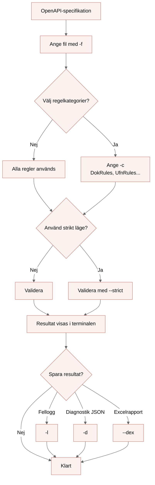
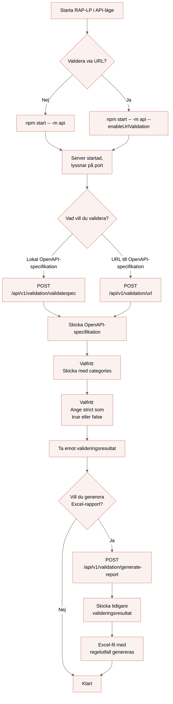

<!--
SPDX-FileCopyrightText: 2025 Digg - Agency for Digital Government

SPDX-License-Identifier: CC0-1.0
-->

# REST API-profil - Lint Processor (RAP-LP)

[](https://github.com/diggsweden/rest-api-profil-lint-processor/tags)

[](LICENSE)
[](https://api.reuse.software/info/github.com/diggsweden/rest-api-profil-lint-processor)

[](https://scorecard.dev/viewer/?uri=github.com/diggsweden/rest-api-profil-lint-processor)

[](publiccode.yml)

## Beskrivning

RAP-LP är ett verktyg för att validera OpenAPI v3-specifikationer mot den svenska REST API-profilen med hjälp av [Spectral](https://github.com/stoplightio/spectral).<br>

Det är specifikt utvecklat för att validera OpenAPI-definitioner enligt den svenska REST API-profilens [specifikation](https://dev.dataportal.se/rest-api-profil).

RAP-LP kan användas lokalt i CLI-läge eller API-läge, eller via [webbgränssnittet](https://raplp.digg.se).

## Innehållsförteckning

<details>
<summary><strong>Installationsguide</strong></summary>

- [Installationsguide](#installationsguide)
  - [Installera via npm](#installera-via-npm)
    - [Installera globalt med NPM](#installera-globalt-med-npm)

    - [Installera lokalt som npm run script](#installera-lokalt-som-npm-run-script)

  - [Installera via NPX](#installera-via-npx)

  - [Installera via Podman](#installera-via-podman)

  - [Installera via Docker](#installera-via-docker)

  - [Alternativ - kör från containern med podman/docker](#alternativ---kör-från-containern-med-podmandocker)

  - [Bygg från källkod](#bygg-från-källkod)

</details>

<details>
<summary><strong>Introduktion</strong></summary>

- [Introduktion](#introduktion)
  - [Regelfiltrering](#regelfiltrering)

  - [Strikt läge (OAS3 Validering)](#strikt-läge-oas3-validering)

</details>

<details>
<summary><strong>CLI-läge</strong></summary>

- [CLI-läge](#cli-läge)
  - [Flaggor för CLI-läge](#flaggor-för-cli-läge)

  - [Loggning i CLI-läge](#loggning-i-cli-läge)

  - [Snabbstart - CLI-läge](#snabbstart---cli-läge)

</details>

<details>
<summary><strong>API-läge</strong></summary>

- [API-läge](#api-läge)
  - [Flaggor för API-läge](#flaggor-för-api-läge)

  - [Endpoints för API-läge](#endpoints-för-api-läge)

  - [Serverkonfiguration](#serverkonfiguration)

  - [Exempel på requests](#exempel-på-requests)

  - [Snabbstart - API-läge](#snabbstart---api-läge)

</details>

<details>
<summary><strong>Mer information</strong></summary>

- [Mer information](#mer-information)
  - [Versioner](#versioner)

  - [Riktlinjer och förklaringar](#riktlinjer-och-förklaringar)

  - [Begränsningar](#begränsningar)

  - [Exempel på regelutfall](#exempel-på-regelutfall)
    - [Förklaring av översikt för regelutfall](#förklaring-av-översikt-för-regelutfall)

    - [Förklaring av detaljering för regelutfall](#förklaring-av-detaljering-för-regelutfall)

  - [FAQ](#faq)
    - [Hur skapar jag ett GitHub Personal Access Token (PAT)?](#hur-skapar-jag-ett-github-personal-access-token-pat)

    - [Skrivåtkomst till mount från container](#skrivåtkomst-till-mount-från-container)

  - [Support](#support)

  - [Bidra](#bidra)

  - [Utveckling](#utveckling)

  - [Licens](#licens)

  - [Underhållare](#underhållare)

  - [Krediter och referenser](#krediter-och-referenser)

</details>

---

## Kom igång

### Installationsguide

Följande instruktioner förutsätter att det finns en `openapi.yaml` att validera i den aktuella katalogen. <br>

Beroende på hur man önskar att nyttja verktyget måste det finnas installerade versioner av `Node.js`,`npm`, `Podman` eller `Docker`.

---

#### Installera via npm

> Notera: Att GitHub Packages (npm) kräver authentisering.<br>
> Konfigurera `.npmrc` mot rätt registry och scope, antingen globalt eller lokalt för enskilda projekt - `@diggsweden:registry=https://npm.pkg.github.com`<br>
> Om du saknar inloggning med GitHub Personal access token (PAT), se [FAQ](#hur-skapar-jag-ett-github-personal-access-token-pat).
>
> Notera: Att `<version>` byts ut mot önskad version av verktyget, oftast senaste release tag. För mer information se [versioner](#versioner).

---

##### Installera globalt med NPM

```bash
npm i -g @diggsweden/rest-api-profil-lint-processor@<version>
raplp -f openapi.yaml
```

> Notera: Att en omstart av terminal kan behövas för att `raplp` ska kunna användas som kommando.

---

##### Installera lokalt som `npm run` script

Installera och lägg som `devDependencies`:

```text
npm i --save-dev @diggsweden/rest-api-profil-lint-processor@<version>
```

Lägg till ett [`npm run` script](https://docs.npmjs.com/commands/npm-run) i din `package.json` med rätt sökväg till filen du vill validera:

```json
{
  "scripts": {
    "lint-processor": "raplp -f openapi.yaml"
  }
}
```

Nu kan du använda `npm run lint-processor`.

---

#### Installera via NPX

Kör utan installation och package.json:

```bash
npx @diggsweden/rest-api-profil-lint-processor@<version> -f openapi.yaml
```

> Notera: Att npx laddar ned paketet till en tillfällig cache-mapp om det inte redan finns en version i node_modules/.bin

---

#### Installera via Podman

Kör med podman:

```bash
podman run --rm -v $(pwd):/data ghcr.io/diggsweden/rest-api-profil-lint-processor:<version> -f /data/openapi.yaml
```

---

#### Installera via Docker

Kör med docker:

```bash
docker run --rm -v $(pwd):/data ghcr.io/diggsweden/rest-api-profil-lint-processor:<version> -f /data/openapi.yaml
```

> Notera: Sökvägar kan hanteras olika beroende på miljö:
>
> - Podman (Linux/macOS/WSL): -v $(pwd):/app/example
> - Docker (PowerShell): -v "${PWD}:/app/example"
> - Docker (CMD): -v %cd%:/app/example

---

#### Alternativ - kör från containern med podman/docker

1. Starta en podman/docker container:

   ```bash
   podman run --rm -it --entrypoint /bin/sh -v $(pwd):/app/data ghcr.io/diggsweden/rest-api-profil-lint-processor:<version>
   ```

2. Kör din validering ifrån containern:

   ```bash
   npm start -- -f /data/openapi.yaml
   ```

> Notera: Att det kan uppstå problem vid körningar med podman och docker i kombination med [flaggor](#tillgängliga-flaggor) som sparar information till filer. Användarens skrivrättigheter kan göra att filer inte dyker upp som önskat. Filerna kan finnas i containern men dyker inte i den mountade katalogen som specificerats. Se [FAQ](#skrivåtkomst-till-mount-från-container) för mer information.

---

#### Bygg från källkod

1. Klona ned projektet, gärna från senaste release tag.
2. Installera alla beroenden:

```bash
npm install
npm start -- -f openapi.yaml
```

> Notera: Att alla kommandon lokalt körs med `npm start --`.

---

## Introduktion

Verktyget går att köra lokalt i två olika lägen

**CLI** och **API** läge. Om inget läge sätts manuellt, är CLI alltid default.

**Lägesövergripande kommandon**

| Kommando     | Beskrivning                                                                                | Typ     | Standard | Obligatorisk |
| ------------ | ------------------------------------------------------------------------------------------ | ------- | -------- | ------------ |
| `--help`     | Visar tillgängliga kommandon, flaggor och användningsinformation för verktyget.            | Boolean | `false`  | Nej          |
| `--version`  | Visar aktuell version av RAP-LP.                                                           | Boolean | `false`  | Nej          |
| `-m, --mode` | Anger vilket körläge verktyget ska använda, om inget anges startas CLI-läge per automatik. | String  | `CLI`    | Nej          |

### Regelfiltrering

Oavsett vilket läge du kör går det att filtrera vilka regelkategorier du vill validera emot.

I dagsläget är följande regelkategorier från REST API-profilen tillgängliga:

| Regelkod | Regelkategori                            |
| -------- | ---------------------------------------- |
| DokRules | Dokumentation                            |
| DotRules | Datum- och tidsformat                    |
| ResRules | Resurser                                 |
| UfnRules | URL Format och namngivning               |
| MogRules | Mognad                                   |
| SakRules | Säkerhet                                 |
| AmeRules | API Message                              |
| ArqRules | API Request                              |
| FelRules | Felhantering                             |
| VerRules | Versionshantering                        |
| FnsRules | Filtrering, paginering och sökparametrar |
| ForRules | Förutsättningar                          |

Se information om hur du väljer regelkategorier vid validering under rubriken för antingen [CLI](#cli-läge) eller [API](#exempel-på-requests) läge.

### Strikt läge (OAS3 Validering)

Strikt-läge aktiverar validering av OpenAPI-specifikationens struktur och semantik enligt OpenAPI 3 (OAS3).

När `--strict` används verifieras OpenAPI-specifikationen först enligt OAS3.
Kontrollen säkerställer att specifikationen är korrekt uppbyggd och semantiskt giltig innan validering mot REST API-profilens regler utförs.

Flaggan `--strict` fungerar både med CLI och API-läge.
I API-mode är strikt läge default, men kan stängas av.<br>
Aktivera strikt-läge med:

```bash
raplp -f openapi.yaml --strict
```

Exempel på resultat när --strict används i kombination med CLI-läge:

```bash
Strict validation reported issues:
- Structural at components : should NOT have additional properties (line 6)
- Semantic at components.tags : Property "tags" is not expected to be here. (line 7)
```

---

## CLI-läge

### Flaggor för CLI-läge

| Flagga             | Beskrivning                                                                                                                                                                         | Typ    | Standard | Obligatorisk |
| ------------------ | ----------------------------------------------------------------------------------------------------------------------------------------------------------------------------------- | ------ | -------- | ------------ |
| `-f, --file`       | Sökväg till OpenAPI-specifikation (YAML/JSON).                                                                                                                                      | String | –        | Ja           |
| `-c, --categories` | Regelkategorier separerade med kommatecken. Tillgängliga: `DokRules, DotRules, ResRules, UfnRules, MogRules, SakRules, AmeRules, ArqRules, FelRules, VerRules, FnsRules, ForRules`. | String | –        | Nej          |

### Loggning i CLI-läge

RAP-LP erbjuder stöd för att logga fel, exportera diagnostiseringsinformation samt generera rapporter baserade på resultatet från en validering. Läs mer om de olika alternativen för CLI-läge nedan.

<details>
<summary><strong>Flaggor för loggning</strong></summary>

| Flagga                | Beskrivning                                                                             | Typ     | Standard            | Obligatorisk |
| --------------------- | --------------------------------------------------------------------------------------- | ------- | ------------------- | ------------ |
| `-l, --logError`      | Sökväg till fil för felloggning från RAP-LP. Om inte angiven skrivs loggen till stdout. | string  | stdout (om ej satt) | Nej          |
| `-a, --append`        | Append—utökar loggen i befintlig felloggningsfil (om `--logError` används).             | boolean | `false`             | Nej          |
| `-d, --logDiagnostic` | Sökväg till fil för diagnostiseringsinformation från RAP-LP i JSON-format.              | string  | –                   | Nej          |
| `--dex`               | Sökväg till fil för diagnostiseringsinformation från RAP-LP i Excel-format.             | string  | –                   | Nej          |

</details>
<br>
<details>
<summary><strong>Validering som skriver felmeddelanden till en valfri loggfil</strong></summary>
För att skriva felmeddelanden till en valfri loggfil, lägg till `-l <FILE>`

```bash
raplp -f openapi.yaml -l raplp.log
```

> Notera: Att varje körning skriver över den tidigare loggfilen.

För att lägga till loggning i samma fil, lägg till `-a`

```bash
raplp -f openapi.yaml -l raplp.log -a
```

</details>
<br>
<details>
<summary><strong>Validering som sparar loggdiagnostik i en fil</strong></summary>
För att spara loggdiagnostik i en fil, lägg till `-d <FILE>`

```bash
raplp -f openapi.yaml -d logDiagnostic.log
```

</details>
<br>
<details>
<summary><strong>Validering som sparar information om regelutfall i en Excel-fil</strong></summary>

För att spara information om regelutfall från diagnostiseringen till en avstämningsfil i Excel, lägg till `--dex`.<br>
Om en specifik sökväg till avstämningsfilen ska anges, kan denna läggas till.<br>
Om ingen sökväg anges, genererar verktyget automatiskt en ny avstämningsfil i den katalog där det körs.

[Avstämningsfilen](document/Avstaemning_REST_API_profil_v_1_2_0_0.xlsx) i Excel har ett fast format, om en egen version av filen ska användas måste den utpekade resursen hämtas med en kompatibel version av REST API-profilen.

**Exempel utan sökväg till avstämningsfil i Excel**

```bash
raplp -f openapi.yaml --dex
```

**Exempel med sökväg till avstämningsfil i Excel**

```bash
raplp -f openapi.yaml --dex <PATH>
```

</details>

---

### Snabbstart - CLI-läge



---

## API-läge

Verktyget kan även köras som en lokal HTTP-server, via API (Applikation Programming Interface). I detta läge kan funktionaliteten anropas via HTTP i stället för CLI-flaggor.

### Flaggor för API-läge

| Flagga                      | Beskrivning                                                                   | Typ     | Standard                    | Obligatorisk |
| --------------------------- | ----------------------------------------------------------------------------- | ------- | --------------------------- | ------------ |
| `--enableUrlValidation`     | Aktiverar URL-validering i API-läge.                                          | boolean | `false`                     | Nej          |
| `--urlValidationConfigFile` | Konfigurationsfil för URL-validering (fallback: `./urlValidationConfig.cjs`). | string  | `./urlValidationConfig.cjs` | Nej          |

### Endpoints för API-läge

| Endpoint                             | Beskrivning                                                                          |
| ------------------------------------ | ------------------------------------------------------------------------------------ |
| `/api/v1/validation/rules`           | Används för att hämta lista med tillgängliga regelkategorier som stöds av verktyget. |
| `/api/v1/validation/validatespec`    | Används för att validera en OpenAPI-specifikation mot REST API-profilens regler.     |
| `/api/v1/validation/url`             | Används för att validera en OpenAPI-specifikation från en angiven URL.               |
| `/api/v1/validation/generate-report` | Används för att generera en rapport baserad på ett valideringsresultat.              |
| `/api/v1/api-info`                   | Används för att hämta information om API:et.                                         |

---

### Serverkonfiguration

Vid körning i API-läge från en lokal server kan RAP-LP konfigureras med hjälp av miljövariabler.

| Miljövariabel                         | Beskrivning                                                                                                                                                                                                            |
| ------------------------------------- | ---------------------------------------------------------------------------------------------------------------------------------------------------------------------------------------------------------------------- |
| RAP_LP_JSON_BODY_LIMIT                | Maximalt tillåten storlek på JSON-requests. Defaultvärdet är `3mb`                                                                                                                                                     |
| RAP_LP_MAX_CONCURRENT_REPORTS         | Maximalt antal samtidiga rapportgenereringar som får bearbetas samtidigt. Defaultvärdet är `4`                                                                                                                         |
| RAP_LP_MAX_CONCURRENT_VALIDATIONS     | Maximalt antal samtidiga valideringar som får bearbetas samtidigt. Defaultvärdet är `4`                                                                                                                                |
| RAP_LP_PERF_LOGGING                   | Anger om prestandaloggning ska användas, kan sättas till `true` eller `false`. Funktionen är inaktiverad som standard.                                                                                                 |
| RAP_LP_LOG_TARGET                     | Anger var serverloggar ska skrivas, exempelvis `stdout` eller `stderr`. Defaultvärdet är `stderr`                                                                                                                      |
| RAP_LP_ALLOW_LOCALHOST_URL_VALIDATION | Anger om validering av specifikationer som lagras lokalt på localhost är tillåten. Inställningen används främst vid lokal utveckling och kan sättas till `true` eller `false`. Funktionen är inaktiverad som standard. |
| RAP_LP_PORT                           | Portkonfiguration för vilken port servern ska starta på och lyssna på inkommande requests. Defaultvärdet är `3000`.                                                                                                    |

---

### Exempel på requests

Nedan följer exempel på hur API:ets endpoints kan anropas, inklusive nödvändiga headers, request bodies och exempel med curl.

<details>
<summary><strong>Validera lokal OpenAPI-specifikation (/api/v1/validation/validatespec)</strong></summary>

**Request headers**

```http
Content-Type: application/json
Accept: application/json
```

**Request body**

```json
{
  "yaml": "<base64encoded file>",
  "categories": ["DokRules", "UfnRules"],
  "strict": true
}
```

**Exempel med curl**

```bash
curl -X POST http://localhost:3000/api/v1/validation/validatespec \
  -H "Content-Type: application/json" \
  -H "Accept: application/json" \
  -d "{
    \"spec\": \"$(base64 -w 0 openapi.yaml)\",
    \"categories\": [\"DokRules\", \"UfnRules\"],
    \"strict\": true
  }"
```

</details>
<br>
<details>
<summary><strong>Validera OpenAPI-specifikation via URL (/api/v1/validation/url)</strong></summary>

> Kräver att API-läget startats med `--enableUrlValidation`.

**Request headers**

```http
Content-Type: application/json
Accept: application/json
```

**Request body**

```json
{
  "url": "<URL_TO_YAML_FILE>",
  "categories": ["DokRules", "UfnRules"],
  "strict": true
}
```

**Exempel med curl**

```bash
curl -X POST http://localhost:3000/api/v1/validation/url \
  -H "Content-Type: application/json" \
  -H "Accept: application/json" \
  -d '{
    "url": "<URL_TO_YAML_FILE>",
    "categories": ["DokRules", "UfnRules"],
    "strict": true
  }'
```

</details>
<br>
<details>
<summary><strong>Generera Excel-rapport (/api/v1/validation/generate-report)</strong></summary>

**Request headers**

```http
Content-Type: application/json
Accept: application/vnd.openxmlformats-officedocument.spreadsheetml.sheet
```

**Request body**

```json
{
   "report":[
      {
         "note":"Godkända regler - RAP-LP",
         "rules":[
            ...
         ]
      },
      {
         "note":"Ej godkända regler - RAP-LP",
         "rules":[
           ...
         ]
      },
      {
         "note":"Ej tillämpade regler - RAP-LP",
         "rules":[
           ...
         ]
      }
   ]
}
```

**Exempel med curl**

```bash
curl -X POST http://localhost:3000/api/v1/validation/generate-report \
  -H "Content-Type: application/json" \
  -H "Accept: application/vnd.openxmlformats-officedocument.spreadsheetml.sheet" \
  -o avstamningsfil.xlsx \
  --data-binary @report-payload.json
```

</details>
<br>
<details>
<summary><strong>Hämta tillgängliga regelkategorier (/api/v1/validation/rules)</strong></summary>

**Exempel med curl**

```bash
curl -X GET http://localhost:3000/api/v1/validation/rules \
  -H "Accept: application/json"
```

</details>
<br>
<details>
<summary><strong>Hämta API-information (/api/v1/api-info)</strong></summary>

**Exempel med curl**

```bash
curl -X GET http://localhost:3000/api/v1/api-info \
  -H "Accept: application/json"
```

</details>

---

### Snabbstart - API-läge



---

## Mer information

### Versioner

Main-branchen, feature-brancher, pre-release- och testversioner används med reservation för att de kan innehålla funktionalitet som inte är garanterad att den är testad på samma sätt som en stabil version.

**Stabila versioner**

[Release](https://github.com/diggsweden/rest-api-profil-lint-processor/releases) ska alltid vara stabil och testad, vilket gör den till den föredragna versionen för att nyttja verktyget.<br>
Dessa versioner är taggade med `vX.X.X` utan något suffix.

**Pre-release- och testversioner**

Pre-release-versioner är taggade med följande suffix:

- alpha → tidig testversion, ofta instabil
- beta → mer testad, men fortfarande pre-release
- rc → nära färdigställande, stabil release candidate

Rena testversioner är taggade med `vX.X.X-dev` följt av namnet på den branchen.<br>
Dessa versioner är byggda för att testa funktionalitet som är under utveckling.

Alla versioner av verktyget hittar du här:

- [Container Image](https://github.com/diggsweden/rest-api-profil-lint-processor/pkgs/container/rest-api-profil-lint-processor)
- [NPM Package](https://github.com/diggsweden/rest-api-profil-lint-processor/pkgs/npm/rest-api-profil-lint-processor)

### Riktlinjer och förklaringar

Vill du veta mer om de specifika reglerna som verktyget tillämpar, se avsnittet [GUIDELINES](https://github.com/diggsweden/rest-api-profil-lint-processor/blob/main/GUIDELINES.md) för detaljer.

### Begränsningar

Det går endast att köra RAP-LP mot en enda OpenAPI-specifikation åt gången.

---

### Exempel på regelutfall

#### Förklaring av översikt för regelutfall

Om man väljer att köra verktyget i CLI-läge, så kommer diagnostiseringsinformationen på stdout.<br>
I denna så kommer en sammanställning av det totala regelutfallet att visas.

- Verkställda och godkända regler:
  - OK = Krav bedömt och hanterat för att möta kravet
- Verkställda och ej godkända regler
  - EJ OK = Krav bedömt, men API:et möter inte kravet
- Ej tillämpade regler
  - N/A = Krav bedömt men inte applicerbart på API:et

**Exempel:**


I exemplet ovan framgår det att kraven för reglerna AME.05 och VER.05 är godkända och att det aktuella API:et uppfyller dessa.<br>
Däremot är kravet för regeln DOK.03 inte godkänt, vilket innebär att API:et inte möter detta krav.<br>
Dessutom framgår det att reglerna SAK.10 och DOK.01 inte är tillämpade för det aktuella API:et.

#### Förklaring av detaljering för regelutfall

Tillsammans med diagnostiseringsinformationen följer en detaljerad beskrivning av informationen för regelutfallet. I denna beskrivning framgår följande:

- Allvarlighetsgrad: Anger allvaret av problemet som upptäckts av regeln. De möjliga värdena är error och warning, vilka tolkas enligt följande:
  - Error: Ett uppenbart fel som måste åtgärdas. I REST API-profilen motsvarar detta kravtypen SKALL och SKALL INTE.
  - Warning: Ett möjligt fel som kan behöva åtgärdas. Vissa avvikelser från specifika regler kan dock tolereras. I REST API-profilen motsvarar detta kravtypen BÖR och BÖR INTE.
- Område: Det aktuella området i REST API-profilen som regeln gäller för.
- Sökväg: Sökvägen till felet, det vill säga den JSONPath som pekar på det fält som diagnostiken avser och som orsakade felet.
- Omfattning: Det omfång som denna diagnostik gäller.
- Länk till specifik designregel av kravet som verktyget tillämpar.

**Exempel:**


I exemplet ovan framgår det att kravet för regeln med **id** DOK.06 inte är godkänt och att den aktuella API-specifikationen inte uppfyller detta.<br><br>
**Kravet** har bedömts ha **allvarlighetsgraden** Warning eftersom API-specifikationen bryter mot ett BÖR/BÖR INTE-krav i REST API-profilens **område** för regler som gäller dokumentation.<br><br>
Genom **sökvägen** kan vi se var i den aktuella OpenAPI-specifikationen problemet återfinns.<br><br>
**Omfattningen** visar på vilken rad i din API-specifikation felet börjar och slutar.<br><br>
Längst ned ser du även en hänvisning till specifik dokumentation om den **designregel** som verktyget tillämpat.

---

### FAQ

#### Hur skapar jag ett GitHub Personal Access Token (PAT)?

1. Gå till GitHub → Settings → Developer settings → Personal access tokens → Tokens (classic) → Generate new token → Generate new token (classic).
2. Sätt en beskrivning för ditt token under `Note` och ett utgångsdatum under `Expiration` (ha utgångsdatum!).
3. Select scopes → read:packages
4. Skapa token → kopiera värdet direkt (visas bara en gång).

```bash
npm login --registry=https://npm.pkg.github.com
# username: ditt GitHub-användarnamn
# password: GitHub PAT med read:packages
```

```bash
podman login ghcr.io
# username: ditt GitHub-användarnamn
# password: GitHub PAT med read:packages
```

#### Skrivåtkomst till mount från container

Vid körningar med podman och docker i kombination med flaggor som sparar information till filer kan det uppstå problem kring skrivrättigheter som gör att filer inte dyker upp som önskat. Filerna kan finnas i containern men dyker inte i den mountade katalogen som specificerats.

Se till att containern har rättigheter att skriva till den katalog som du mountar.

1. Kolla rättigheter

   ```bash
   ls -ld /path/to/mount
   ```

2. Prova köra som `root user`

   ```bash
   podman run -it -v $(pwd):/data --user root ghcr.io/diggsweden/rest-api-profil-lint-processor:<version> -f /data/openapi.yaml -l /data/raplp.log --dex /data/avstamning.xlsx
   ```

3. För att testa om det är ett åtkomstproblem kan du temporärt prova om det går efter du gett alla skrivrättigheter till den mountade katalogen:

   ```bash
   sudo chmod 777 /path/to/mount
   ```

4. Beroende på din miljö och vilka möjligheter du har, hantera åtkomstproblemet mer beständigt och återställ tidigare läs- och skrivrättigheter.
5. Du kan även prova:

   ```bash
   sudo podman run -it -v $(pwd):/data ghcr.io/diggsweden/rest-api-profil-lint-processor:<version> -f /data/openapi.yaml -l /data/raplp.log --dex /data/avstamning.xlsx
   ```

---

### Support

Om du har frågor, funderingar, buggrapporter etc. Vänligen kontakta [Digg - Agency for Digital Government](mailto:raplp-maintenance@digg.se).

### Bidra

Om du vill bidra till projektet, vänligen följ instruktionerna i avsnittet [Contributing](CONTRIBUTING.md).<br>
För utvecklare finns det mer information i avsnittet [Development](development/DEVELOPMENT.md).

### Utveckling

Vänligen kontakta [Digg - Agency for Digital Government](https://www.digg.se/)

### Licens

**Programkod**<br>
[European Union Public Licence v. 1.2](https://eupl.eu/1.2/en/)

**Dokumentation, övrigt**<br>
[CC0 1.0](https://creativecommons.org/publicdomain/zero/1.0/)

### Underhållsansvariga

[Digg - Agency for Digital Government](https://github.com/diggsweden)

### Krediter och referenser

Speciellt tack till [Arbetsförmedlingen – The Swedish Public Employment Service](https://arbetsformedlingen.se/)
