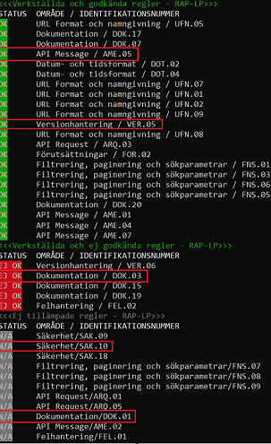
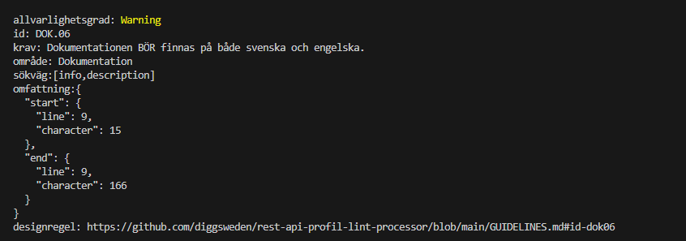

<!--
SPDX-FileCopyrightText: 2023 Digg - Agency for Digital Government

SPDX-License-Identifier: CC0-1.0
-->

# REST API-profil - Lint Processor (RAP-LP)

[](#)
[](#)
[](#)


**Beskrivning**:

RAP-LP är ett kommandoradsverktyg för att linta OpenAPI v3-definitioner med hjälp av [Spectral](https://github.com/stoplightio/spectral). Verktyget är specifikt utvecklat för att linta OpenAPI-definitioner enligt den svenska REST API-profilens specifikation [REST API-profil](https://dev.dataportal.se/rest-api-profil).


## Innehållsförteckning

- [REST API-profil - Lint Processor (RAP-LP)](#rest-api-profil---lint-processor-rap-lp)
  - [Innehållsförteckning](#innehållsförteckning)
  - [Installation och krav](#installation-och-krav)
  - [Instruktioner för att komma igång snabbtt](#instruktioner-för-att-komma-igång-snabbt)
  - [Användning](#användning)
  - [Kända problem](#known-issues)
  - [Support](#support)
  - [Bidra](#bidra)
  - [Utveckling](#utveckling)
  - [Licens](#licens)
  - [Underhållare](#underhållare)
  - [Krediter och referenser](#krediter-och-referenser)

## Installation och krav

Det enklaste sättet att installera RAP-LP är genom att använda [npm](https://www.npmjs.com/):

1. Klona ned projektet
2. Installera alla beroenden:

```bash
$ npm install
```

## Instruktioner för att komma igång snabbt

Använd det här kommandot för att köra applikationen mot en YAML-fil:

```bash
$ npm start -- -f Path_to_the_YAML_file
```

**Exempel**

```bash
$ npm start -- -f apis/dok-api.yaml
```

## Användning

För att validera mot en specifik kategori av regler, lägg till `-c CategoryName`.

**Exempel**

```bash
$ npm start -- -f apis/dok-api.yaml -c DokRules
```

**Tillgängliga kategorier med regler**

- AmeRules
- ArqRules
- DokRules
- DotRules
- FelRules
- FnsRules
- ForRules
- SakRules
- UfnRules
- VerRules

För att spara meddelanden från felloggar, lägg till `-l FileName`.

**Exempel**

```bash
$ npm start -- -f apis/dok-api.yaml -l rap-lp.log
```

För att lägga till loggning, lägg till `-a`

**Exempel**

```bash
$ npm start -- -f apis/dok-api.yaml -l rap-lp.log -a
```

För att spara loggdiagnostik i en fil, lägg till `-d FileName`

**Exempel**

```bash
$ npm start -- -f apis/dok-api.yaml -d logDiagnostic.log
```
För att spara information om regelutfall från diagnostiseringen till en avstämningsfil i Excel, lägg till --dex.

Om en specifik sökväg till avstämningsfilen ska anges, kan denna läggas till. Om ingen sökväg anges, genererar verktyget automatiskt en ny avstämningsfil i den katalog där det körs.

Avstämningsfilen i Excel har ett fast format. Om en egen version av filen ska användas, måste den utpekade resursen hämtas med en kompatibel version av REST API-profilen.

**Exempel utan sökvög till avstämningsfil i Excel**

```bash
$ npm start -- -f apis/dok-api.yaml --dex
```

**Exempel med sökvög till avstämningsfil i Excel**

```bash
$ npm start -- -f apis/dok-api.yaml --dex path-to-excel-file
```


För att visa aktuell version av verktyget, lägg till `--version`

**Exempel**

```bash
$ npm start -- -f apis/dok-api.yaml -d logDiagnostic.log
```
**Visa hjälp**

```bash
$ npm start -- --help
```


**Förklaring av översikt för regelutfall:**

Om man väljer att köra verktyget i console läge, så kommer diagnostiseringsinformationen på stdout. I denna så kommer en sammanställning av det totala regelutfallet att visas.   
- Verkställda och godkända regler: 
  - OK = Krav bedömt och hanterat för att möta kravet
- Verkställda och ej godkända regler
  - EJ OK = Krav bedömt, men API:et möter inte kravet
- Ej tillämpade regler
  - N/A = Krav bedömt men inte applicerbart på API:et

**Exempel:**



I exemplet ovan framgår det att kraven för reglerna AME.05 och VER.05 är godkända och att det aktuella API:et uppfyller dessa. Däremot är kravet för regeln DOK.03 inte godkänt, vilket innebär att API:et inte möter detta krav. Dessutom framgår det att reglerna SAK.10 och DOK.01 inte är tillämpade för det aktuella API:et.

**Förklaring av detaljering för regelutfall:**

Tillsammans med diagnostiseringsinformationen följer en detaljerad beskrivning av informationen för regelutfallet. I denna beskrivning framgår följande:

- Allvarlighetsgrad: Anger allvaret av problemet som upptäckts av regeln. De möjliga värdena är error och warning, vilka tolkas enligt följande:
  - Error: Ett uppenbart fel som måste åtgärdas. I REST API-profilen motsvarar detta kravtypen SKALL och SKALL INTE.
  - Warning: Ett möjligt fel som kan behöva åtgärdas. Vissa avvikelser från specifika regler kan dock tolereras. I REST API-profilen motsvarar detta kravtypen BÖR och BÖR INTE.
 - Område: Det aktuella området i REST API-profilen som regeln gäller för.
 - Sökväg: Sökvägen till felet, det vill säga den JSONPath som pekar på det fält som diagnostiken avser och som orsakade felet.
 - Omfattning:  Det omfång som denna diagnostik gäller.
  
**Exempel:**



I exemplet ovan framgår det att kravet för regeln DOK.01 inte är godkänt och att det aktuella API:et inte uppfyller detta. Kravet har bedömts ha allvarlighetsgraden Error eftersom API:et bryter mot ett SKALL/SKALL INTE-krav i REST API-profilen. Det finns också information om var i den aktuella OpenAPI-specifikationen problemet återfinns.

Vidare framgår det att kravet för regeln DOK.03 inte är godkänt och att det aktuella API:et inte möter detta krav. Kravet har bedömts ha allvarlighetsgraden Warning eftersom API:et bryter mot ett BÖR/BÖR INTE-krav i REST API-profilen. Även här finns information om var i den aktuella OpenAPI-specifikationen problemet återfinns.


## Kända problem

- Det går endast att köra RAP-LP mot en enda YAML-fil åt gången.

## Support

Om du har frågor, funderingar, buggrapporter etc, vänligen kontakta [Digg - Agency for Digital Government](https://www.digg.se/)

## Bidra

Om du vill bidra till projektet, vänligen följ instruktionerna i avsnittet [Contributing](CONTRIBUTING).

## Utveckling

- Please contact [Digg - Agency for Digital Government](https://www.digg.se/)

## Licens

European Union Public Licence v. 1.2
Se [LICENS](LICENSE) för mer detaljer.

Copyright: [Contributor Covenant](https://www.contributor-covenant.org/)

Licens: [CC-BY-4.0](https://creativecommons.org/licenses/by/4.0/)

## Underhållare

[Digg - Agency for Digital Government](https://github.com/diggsweden)

## Krediter och referenser

Speciellt tack till

- [Arbetsförmedlingen – The Swedish Public Employment Service](https://arbetsformedlingen.se/)
